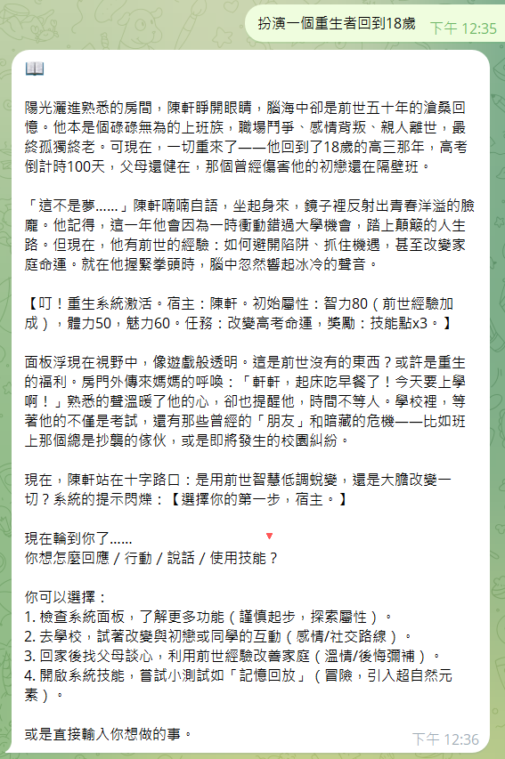

# Story Chain — 多元宇宙互動故事接龍

讓 AI 與玩家一起編織無限分支的故事宇宙 — 有趣、瘋狂、容易上手。

為什麼這個 Skill 必火？

- 極度上癮：每個決定都會打開新的宇宙分支，結果出乎意料且充滿驚喜。 
- 超高互動性：玩家、AI 與 NPC 連動，故事不是單向被看，而是一起創造。 
- 可自定義：輕鬆加入角色、世界設定與規則，適合短篇創作或長篇多人接龍。 
- 支援 RPG 屬性擴充：可選擇加上屬性、裝備、成長系統，讓故事與遊玩並存。

快速瀏覽

- 適合：創作者、遊戲設計師、同好社群、以及喜歡即興劇場的玩家。
- 格式：以段落接龍 + 選項分支為核心，可延伸成文字冒險或劇本式多人遊玩。

亮點特性

- 多元宇宙分支系統：每個選擇自動建立平行節點，回溯與合流都簡單處理。
- 可視化節點樹（未來擴充）：匯出節點資料，方便做視覺化呈現。 
- 模組化技能（Skill）：把玩法拆成小模組，容易組合或分享給其他專案。 
- 範例與模板：內含範例故事、角色設定與快速上手檔案。

快速上手

1. 下載 `./dist` 中的 zip 檔。

2. 將 zip 檔傳給你的 agent (如: OpenClaw、NextClaw、nanoclaw ...) 他/她/它 知道該怎麼做。

3. 開始一個故事接龍（示例）：

```text
玩家：我進入一間古老圖書館，燈光忽明忽暗。
AI：你在書架間發現一冊沒有書名的日記。你要（A）翻開它、（B）把它放回原處。
```

4. 選擇後繼續接龍，AI 根據分支記錄生成後續情節與結果。

範例故事模組

- `sample_normal.md`：輕量接龍範本
- `sample_with_erotic.md`：成人向範本（請注意使用場域與法規）


準備好了嗎？把你的第一個選擇貼上來，讓多元宇宙開始運轉！

